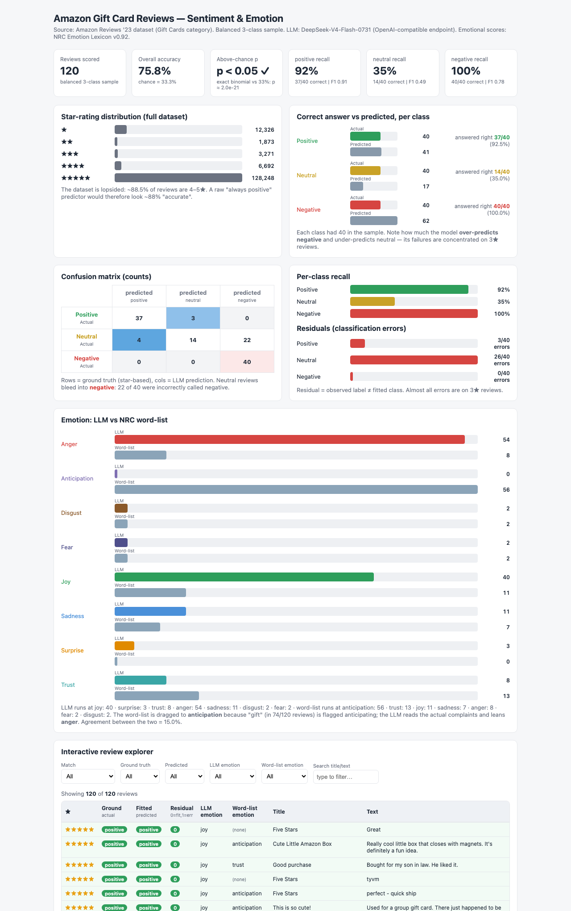
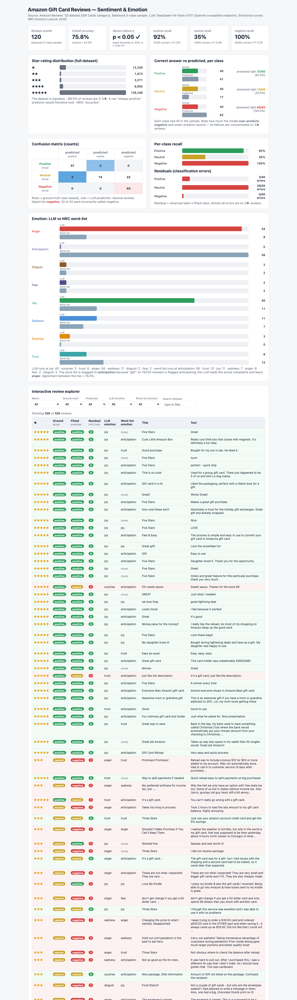

# Amazon Gift Card Reviews — Sentiment & Emotion Classification

A self-contained dashboard and reproducible pipeline that classifies the
**sentiment** (3-class: positive / neutral / negative) and dominant
**emotion** (one of 8) of Amazon Gift Card reviews using an LLM, then compares
the LLM's emotion reading against a transparent, model-free **NRC word-list**
scorer.





---

## Data source

**Amazon Reviews '23** dataset — **Gift Cards** category.

This project uses the raw JSON-lines review file:

```
https://mcauleylab.ucsd.edu/public_datasets/data/amazon_2023/raw/review_categories/Gift_Cards.jsonl.gz
```

The Amazon Reviews '23 dataset (McAuley Lab, Univ. of California San Diego)
is documented at <https://amazon-reviews-2023.github.io/> and the public
download portal at <https://cseweb.ucsd.edu/~jmcauley/datasets.html>.

Each review record contains a 1–5 star `rating`, a `title`, a `text` body, an
`asin`, a `user_id`, a timestamp, and helpfulness/verification flags. All
152,410 Gift Card reviews were downloaded (12.3 MB gzip / 48 MB plain).

**Used lexicon:** the NRC Word-Emotion Association Lexicon v0.92 (Saif M.
Mohammad & Peter D. Turney, *Emotions Evoked by Common Words and Phrases: Using
Mechanical Turk to Create an Emotion Lexicon*), bundled in
`data/NRC-emotion-lexicon-wordlevel-alphabetized-v0.92.txt`. It is published
for research/educational purposes; cite the authors if republishing.

---

## What the pipeline does

| Step | Script | Purpose |
|---|---|---|
| 1. Score | `score_reviews.py` | Draw a **balanced** 3-class sample (40 positive / 40 neutral / 40 negative) and call the LLM for sentiment + emotion per review |
| 2. Emote (word-list) | `add_wordlist_emotions.py` | Add a model-free emotion derived from the NRC lexicon (no model calls) |
| 3. Visualise | `make_dashboard.py` | Render `dashboard.html` — one self-contained page (all CSS/JS/data inline) |
| — prompt | `prompt.txt` | The exact system/user prompt used for the LLM |

**Model:** `DeepSeek-V4-Flash-0731` via an OpenAI-compatible `/v1/chat/completions`
endpoint (vLLM). Output is constrained with `guided_json` so `sentiment` is one
of `positive|neutral|negative` and `emotion` is one of the 8 NRC emotions —
guaranteeing parseable, in-schema predictions for every review.

**Ground-truth sentiment** comes from the star rating:
`4–5★ = positive`, `3★ = neutral`, `1–2★ = negative`. (Emotions have no rating
ground truth; the word-list is the comparison signal, see Q3.)

One balanced run's raw output is committed at
[`results/balanced_run_emotions.jsonl`](results/balanced_run_emotions.jsonl).

---

## The dashboard

The dashboard is served **live** on GitHub Pages (no install or server needed):

**https://etmc7689.github.io/amazon-gift-card-sentiment-dashboard/**

`dashboard.html` opens in any browser with no network access (fully
self-contained); `index.html` is an identical copy that Pages serves at the
root. It shows:

- **Star-rating distribution** of the full 152,410-review dataset.
- **Correct answer vs predicted, per class** — how many of each class the
  model *should* produce vs *did* produce, plus "answered right" per class.
- **3×3 confusion matrix** (ground truth × predicted).
- **Per-class recall**.
- **Emotion comparison** — LLM emotion vs NRC word-list emotion.
- **Interactive review explorer** — filter the 120-sample table by
  correct/mismatch, ground-truth class, predicted class, LLM emotion,
  word-list emotion, or free text, with a live count.
- **Fitted vs residual** — the table exposes each review's **fitted**
  (predicted) class and a **residual** flag (`0` = fit matched the observed
  label, `1` = error); a "Residuals (classification errors)" chart breaks the
  errors down by observed class.

### Key figures (balanced 3-class sample, 120 reviews)

| Class | Actual | Predicted | Correct | Recall | Precision | F1 |
|---|--:|--:|--:|--:|--:|--:|
| positive (4–5★) | 40 | 41 | 37 | 92.5% | 90.2% | 0.914 |
| neutral (3★) | 40 | 17 | 14 | 35.0% | 82.4% | 0.491 |
| negative (1–2★) | 40 | 62 | 40 | 100% | 64.5% | 0.784 |

**Overall accuracy: 75.8%** (chance baseline with balanced sampling = 33.3%).

Confusion matrix (rows = ground truth, columns = predicted):

|  | predicted positive | predicted neutral | predicted negative |
|---|--:|--:|--:|
| **actual positive** | **37** | 3 | 0 |
| **actual neutral** | 4 | **14** | 22 |
| **actual negative** | 0 | 0 | **40** |

These numbers are computed in `make_dashboard.py` from
`results/balanced_run_emotions.jsonl` and rendered verbatim on the page; they
were cross-checked in a browser against the saved output.

---

## Discussion

### Q1. Why did the lopsided run look very accurate — and what did balancing change?

Gift Card reviews are overwhelmingly positive. Of the 152,410 reviews,
134,940 (≈ **88.5%**) are 4–5★, 14,199 (≈ 9.3%) are 1–2★, and only 3,271
(≈ 2.1%) are 3★. A trivial predictor that **always returns "positive"** would
therefore achieve ≈ **88.5% accuracy** on that distribution without looking at
a single word — so any model scored on the raw, lopsided data "looks very
accurate" almost regardless of quality.

Sampling **equal amounts of each class** removes that illusion: each class now
contributes the same weight, the random-chance baseline drops to **33.3%**,
and the balanced accuracy (75.8%) reflects how well the model actually handles
each class rather than how big the majority class is. The balancing is what
surfaced that neutrals are handled poorly — a fact a lopsided run hides.

A one-sided exact binomial test (91/120 correct, vs. the 1/3 chance that a
guessing model would achieve) gives **p ≈ 2×10⁻²¹ (p < 0.05)**, formally
confirming the model performs far above chance on the balanced sample.

### Q2. Where do the model's mistakes go?

Failures concentrate almost entirely on **3★ neutral** reviews, and they bleed
**toward "negative"**:

- **22 of 40 neutrals (55%)** were predicted *negative*;
- 4 of 40 (10%) were predicted *positive*;
- 3 of 40 (7.5%) positives were downgraded to *neutral*;
- **0 of 40 negatives** were misclassified (100% recall).

In aggregate the model **over-produces "negative"**: it predicts 62 negatives
when only 40 exist, and under-produces "neutral" (17 predicted vs 40 actual).
The direction of error is thus *neutral → negative* (not the reverse): the
model reads the hedged, mildly-critical language common in 3★ Gift Card
reviews (shipping delays, activation fees, bent tins) as an outright complaint
and over-weights it. This is visible at a glance in the dashboard's confusion
matrix and the "correct answer vs predicted" chart, where the negative bar
(62) towers over its actual count (40).

### Q3. How do the LLM's emotions and the word-list's emotions differ — and why?

They barely agree: **18/120 (15%)**.

| Emotion | LLM | NRC word-list |
|---|--:|--:|
| anger | 54 | 8 |
| joy | 40 | 11 |
| sadness | 11 | 7 |
| trust | 8 | 13 |
| surprise | 3 | 0 |
| disgust | 2 | 2 |
| fear | 2 | 2 |
| anticipation | 0 | 56 |
| (no word matched) | — | 21 |

The difference is *contextual vs lexical*:

- **The word-list is literal.** It scores each word against the lexicon and
  picks the highest-scoring emotion. Because "gift" appears in 74 of the 120
  reviews and is flagged in the NRC lexicon as *anticipation/joy/surprise*
  (and "good"/"money" also carry *anticipation*), the word-list assigns
  **anticipation** to nearly half the corpus — even to reviews that complain.
- **The LLM reads what the review is actually saying.** Most Gift Card
  reviews are short and, when negative, driven by *anger* (fees, damage,
  billing) — hence the LLM's anger-heavy, joy-secondary distribution. It also
  respects tone, so it returns a far more varied spread and never once
  guesses "anticipation" for a complaint.

In short, the word-list reflects *what words are about globally*; the LLM
reflects *what each review is about in context*. Neither is "wrong" — they
answer a different question, and the 15% agreement is a good illustration of
why literal bag-of-words emotion detection diverges from contextual reading.

### Q4. Bugs and issues hit along the way

1. **Reasoning-model token truncation.** The first endpoint calls returned
   empty `content` with `max_tokens` set low (10–512): DeepSeek-V4 is a
   *reasoning* model, and on hard (mostly 3★) reviews it spent its budget on
   chain-of-thought before emitting the answer, so 5/120 came back unparseable.
   **Fix:** raise `max_tokens` to 1024 **and** constrain output with
   `guided_json` (enum schema), which forces valid `sentiment`/`emotion`
   values — the rerun had **0 unparseable rows** out of 120.
2. **Off-schema output.** The model occasionally answered with out-of-vocabulary
   values (`"classification":"mixed"`, `"disappointed"`). **Fix:** the same
   `guided_json` enum constraint eliminates non-schema values entirely.
3. **Word-list tie-break artefact.** Reviews with *no* lexicon match ended up
   assigned a spurious "anger" because every emotion tied at 0. **Fix:** a
   review with zero matched words is now marked *no match* (21 of 120).
4. **`int("5.0")` runtime error.** Rating keys arrive as JSON strings like
   `"5.0"`; a naive `int()` crashed the dashboard generator. **Fix:** convert
   via `float` first.
5. **Python f-string/generator bugs.** Multiple syntax errors while building
   `make_dashboard.py`: a backslash inside an f-string *expression*
   (`"<\\/"` escaping), a nested-quote error, and a leftover placeholder.
   **Fix:** precompute the escaped JSON outside the template and drop the
   unused placeholders.
6. **Layout bugs (assignment concern: small chart elements).** Two issues were
   caught and fixed after the first render. (a) The classic "tiny bar collapses
   to zero width" problem: every bar uses `width: max(<pct>, 4px)` above a
   light track, so even near-zero counts still show. (b) The **star-rating**
   chart originally overlaid its count *inside* the bar, so the very short 1–3★
   bars overflowed and the numbers overlapped the axis. **Fix:** each count now
   sits in a fixed-width, right-aligned column (`bar-num`) beside the bar
   track, so a label can never collide with a bar. Verified present on the page
   by rendering in a headless browser: 0 zero-width bars, 0 overlaps, no
   horizontal scroll, and the on-page counts match the saved JSONL.

---

## Reproducing

```bash
# 1. data (already committed where large files are gitignored)
curl -L -o data/Gift_Cards.jsonl.gz \
  https://mcauleylab.ucsd.edu/public_datasets/data/amazon_2023/raw/review_categories/Gift_Cards.jsonl.gz
gzip -dk data/Gift_Cards.jsonl.gz

# 2. balanced 3-class LLM scoring (writes results/balanced_run.jsonl)
python3 score_reviews.py --data data/Gift_Cards.jsonl \
    --output results/balanced_run.jsonl --per-class 40 --workers 8

# 3. word-list emotions (writes results/balanced_run_emotions.jsonl)
python3 add_wordlist_emotions.py --run results/balanced_run.jsonl \
    --lexicon data/NRC-emotion-lexicon-wordlevel-alphabetized-v0.92.txt \
    --out results/balanced_run_emotions.jsonl

# 4. dashboard (writes dashboard.html)
python3 make_dashboard.py --run results/balanced_run_emotions.jsonl --out dashboard.html
```

---

## Authorship & review

This report and the accompanying code were drafted with the assistance of an
AI coding agent (Hermes). All numbers quoted above were pulled from the
committed run output and cross-checked against the rendered dashboard, so
every figure in this document matches a visible value in `dashboard.html` and
in `results/balanced_run_emotions.jsonl`. The narrative, conclusions, and
interpretation were reviewed and put into their final wording by the author,
Ethan McGarvey, who is responsible for the submission.
